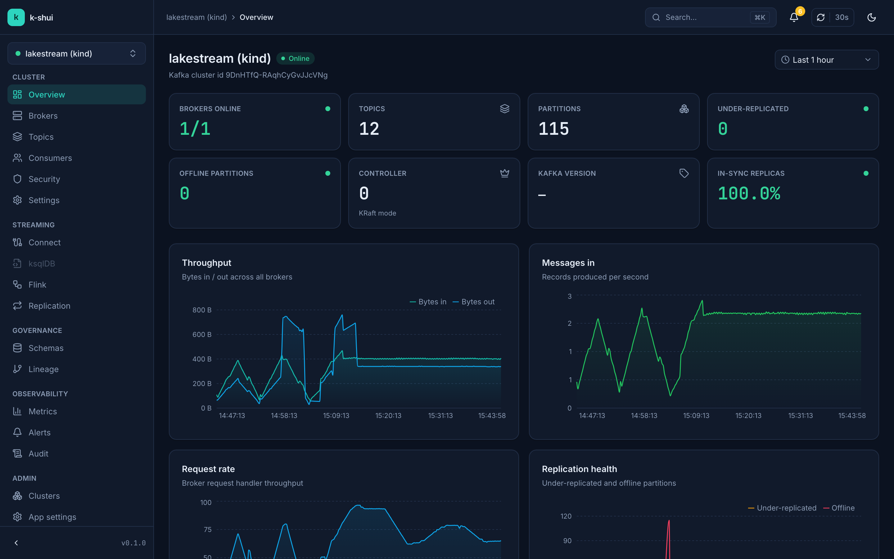
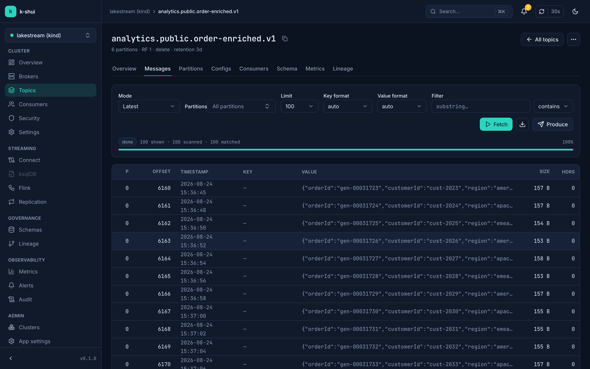
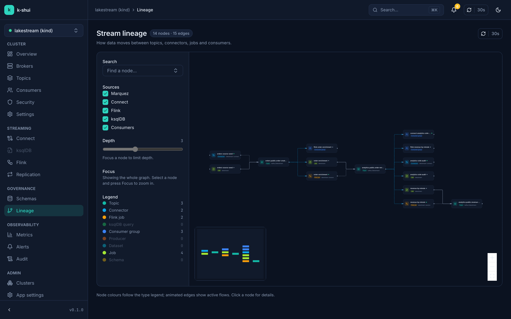
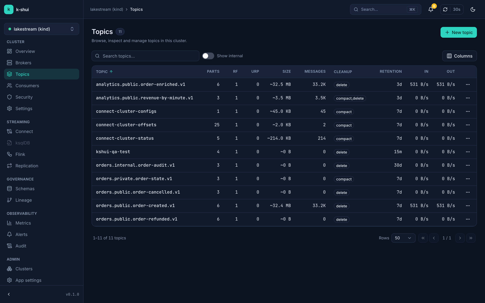
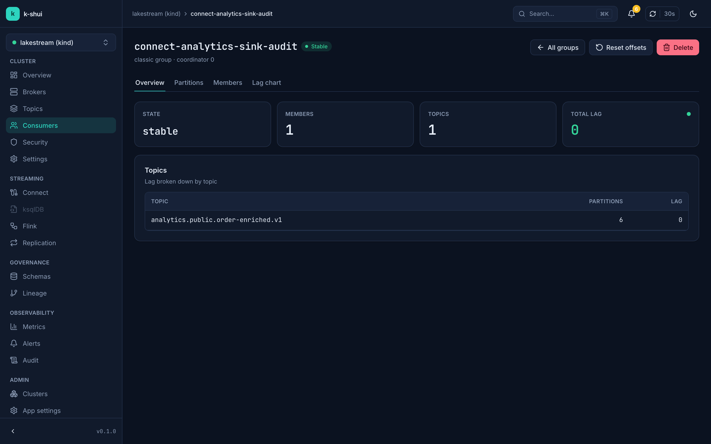
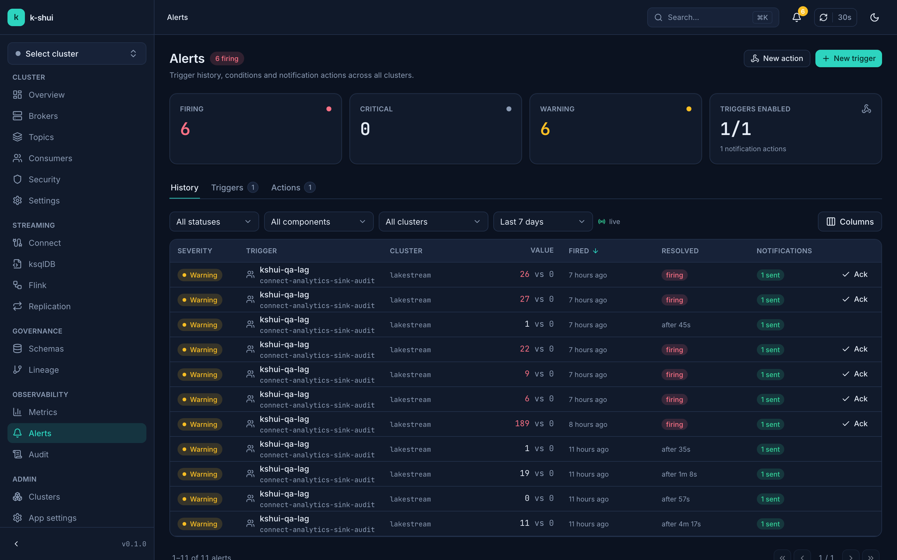
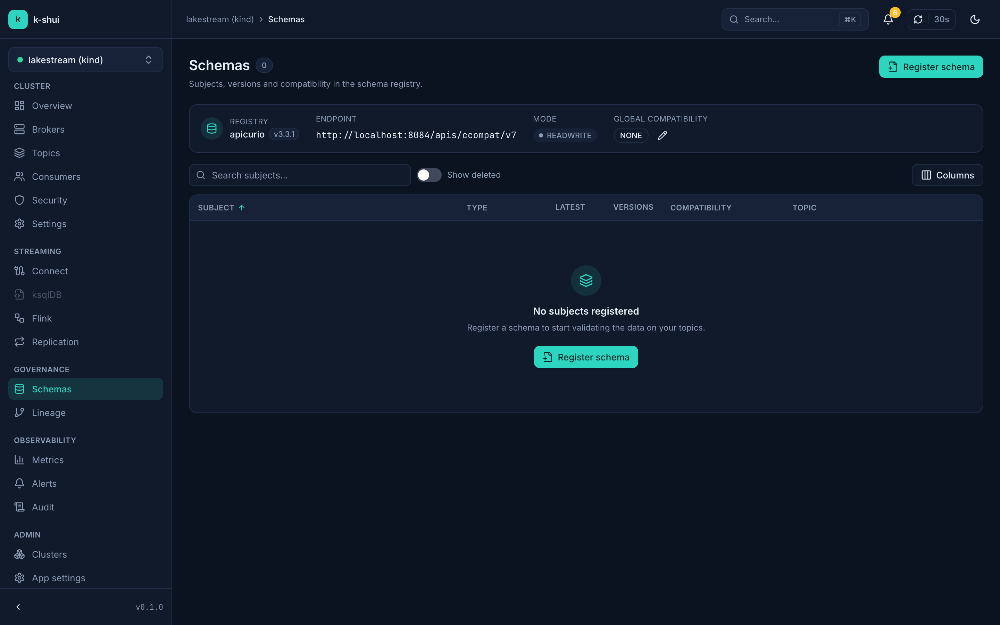
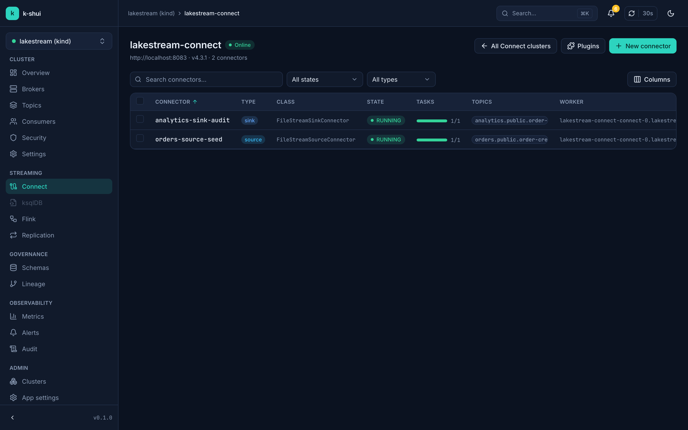
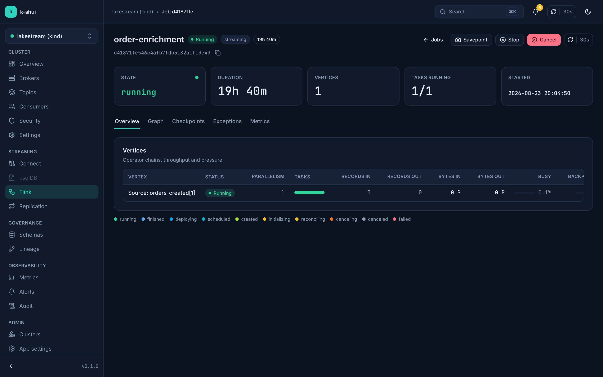
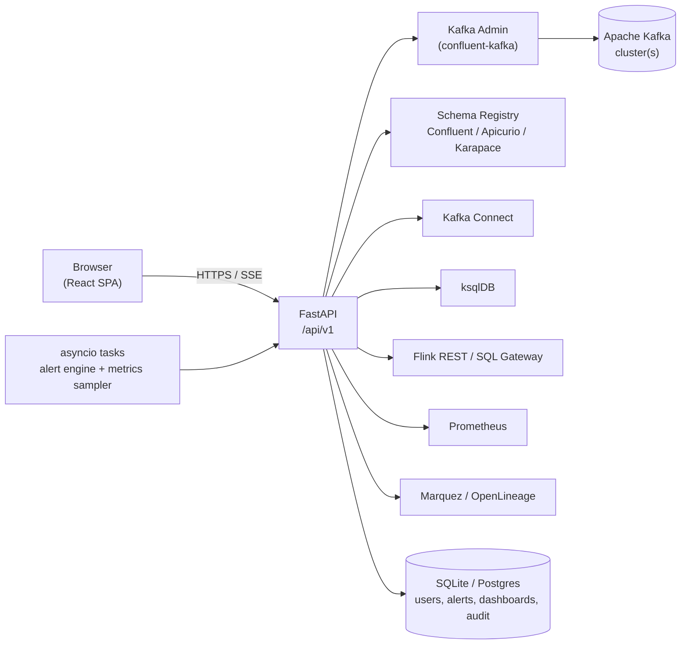

<div align="center">

# k-shui

**Kafka Streaming Hub UI — the open-source control center for Apache Kafka® and its streaming ecosystem**

[](LICENSE)
[](https://github.com/thadchas/k-shui/actions/workflows/ci.yml)
[](https://pypi.org/project/k-shui/)
[](https://www.npmjs.com/package/k-shui)
[](https://github.com/orgs/k-shui/packages/container/package/k-shui)
[](charts/k-shui)

</div>

k-shui is a single, modern web UI for operating Apache Kafka and everything that
grows around it — brokers, topics, consumers, schemas, Connect, ksqlDB, Flink,
metrics, and stream lineage — without stitching together five different tools.
It's Apache-2.0 licensed, ships as a single binary/container, and talks to the
clusters and services you already run.

## Why k-shui

Confluent Control Center is closed-source and license-gated to Confluent Platform.
Everything else in the open-source Kafka UI space covers one slice each — a topic
browser, or a Flink dashboard, or a lineage graph — leaving you with a tab farm.
k-shui unifies:

- **[Kafbat UI](https://github.com/kafbat/kafka-ui)-style** cluster/topic/consumer management
- **Flink UI** job, checkpoint and SQL Gateway operations
- **Kafka Connect** connector/task management, including MirrorMaker2 replication views
- **Schema Registry** (Confluent, Apicurio, Karapace — any `ccompat`-speaking registry)
- **Prometheus/Grafana**-equivalent dashboards, with a zero-dependency sampled-metrics fallback
- **OpenLineage/Marquez** stream lineage, enriched with edges derived from Connect/ksqlDB/Flink/consumer groups

...in one application, with one auth model, one command to start it, and a
design system that doesn't look like five apps welded together.

## Features

| Area | What you get | Docs |
|---|---|---|
| Clusters | Multi-cluster switcher, health checks, throughput, KRaft-aware overview | [clusters.md](docs/features/clusters.md) |
| Brokers | Config editor, log dirs, per-broker metrics | [brokers.md](docs/features/brokers.md) |
| Topics | Create/configure/delete, partition add, purge, clone, config diffing | [topics.md](docs/features/topics.md) |
| Message browser | Live tail (SSE) or paged fetch, produce, JSON/Avro/Protobuf/JSON Schema decode, filter by JSONPath/regex, CSV/NDJSON export | [messages.md](docs/features/messages.md) |
| Consumers & share groups | Lag, members/assignments, offset reset (earliest/latest/timestamp/shift), Kafka 4.x share groups | [consumers.md](docs/features/consumers.md) |
| Schema Registry | Confluent / Apicurio / Karapace — subjects, versions, diff, compatibility check | [schemas.md](docs/features/schemas.md) |
| Kafka Connect | Connector CRUD, pause/resume/restart, task status, plugin validation, MirrorMaker2 replication view | [connect.md](docs/features/connect.md) |
| ksqlDB | SQL editor with streaming results, streams/tables/queries, statement history | [ksqldb.md](docs/features/ksqldb.md) |
| Flink | Jobs, checkpoints, execution graph, task managers, jar upload/run, SQL Gateway | [flink.md](docs/features/flink.md) |
| Metrics | Prometheus-backed dashboards (Grafana-JSON import), PromQL explorer, sampled fallback | [metrics.md](docs/features/metrics.md) |
| Stream lineage | OpenLineage/Marquez graph merged with derived Connect/ksqlDB/Flink/consumer edges | [lineage.md](docs/features/lineage.md) |
| Alerts | Metric-based triggers, buffered conditions, email/Slack/PagerDuty/Teams/webhook actions, history | [alerts.md](docs/features/alerts.md) |
| Security | ACLs, quotas, SCRAM users, KRaft quorum view | [security.md](docs/features/security.md) |
| Settings & audit | Cluster dynamic configs, full audit log of mutating actions | [settings-and-audit.md](docs/features/settings-and-audit.md) |
| Auth & RBAC | None / basic (admin, editor, viewer) / OIDC, light & dark theme | [auth-rbac.md](docs/features/auth-rbac.md) |

## Quick start

Pick whichever you have installed — all four run the same application.

```bash
# uv (no local Python install needed)
uvx k-shui serve

# npx (no local Node/Python install needed — wraps uv/pipx/docker)
npx k-shui serve

# Docker
docker run -p 8090:8090 -e KSHUI_BOOTSTRAP_SERVERS=host.docker.internal:9092 ghcr.io/thadchas/k-shui

# Helm, on Kubernetes
helm install k-shui oci://ghcr.io/thadchas/charts/k-shui
```

Then open **http://localhost:8090**. With no config file at all, k-shui starts
with a single cluster pointed at `localhost:9092` (or `$KSHUI_BOOTSTRAP_SERVERS`).

### A real config

Generate one with `k-shui init`, or start from this:

```yaml
# k-shui.yaml
server:
  port: 8090

clusters:
  - id: prod
    name: Production
    bootstrapServers: kafka-0:9092,kafka-1:9092,kafka-2:9092
    schemaRegistry:
      url: http://schema-registry:8081
      type: confluent
    connect:
      - name: connect
        url: http://connect:8083
    prometheus:
      url: http://prometheus:9090
```

```bash
uvx k-shui serve --config k-shui.yaml
```

See [`docs/getting-started.md`](docs/getting-started.md) for the full install
walkthrough and [`docs/deployment/configuration-reference.md`](docs/deployment/configuration-reference.md)
for every field.

## Screenshots

| Cluster overview | Message browser | Stream lineage |
|---|---|---|
|  |  |  |
| Topics | Consumer group | Alerts |
|  |  |  |
| Schemas | Kafka Connect | Flink job |
|  |  |  |

Shown in dark theme; `docs/images/*-light.png` has light-theme captures of the
clusters, overview, topics and message-browser screens.

## Connect to your existing stack

k-shui speaks plain Kafka Admin protocol plus the standard HTTP APIs of each
integration — no agents, no sidecars.

<details>
<summary><b>Strimzi</b> (Kubernetes-native Kafka)</summary>

```yaml
clusters:
  - id: strimzi
    name: Strimzi cluster
    bootstrapServers: my-cluster-kafka-bootstrap.kafka.svc:9092
    properties:
      security.protocol: SSL
      ssl.ca.location: /etc/k-shui/certs/ca.crt
    schemaRegistry:
      url: http://my-cluster-registry.kafka.svc:8081
      type: apicurio
```
</details>

<details>
<summary><b>Confluent Platform / Confluent Cloud</b></summary>

```yaml
clusters:
  - id: confluent-cloud
    name: Confluent Cloud
    bootstrapServers: pkc-xxxxx.us-east-1.aws.confluent.cloud:9092
    properties:
      security.protocol: SASL_SSL
      sasl.mechanism: PLAIN
      sasl.username: ${CCLOUD_API_KEY}
      sasl.password: ${CCLOUD_API_SECRET}
    schemaRegistry:
      url: https://psrc-xxxxx.us-east-2.aws.confluent.cloud
      type: confluent
      auth: {username: ${SR_API_KEY}, password: ${SR_API_SECRET}}
```
</details>

<details>
<summary><b>Amazon MSK</b></summary>

```yaml
clusters:
  - id: msk
    name: MSK
    bootstrapServers: b-1.mycluster.abc123.c2.kafka.us-east-1.amazonaws.com:9098
    properties:
      security.protocol: SASL_SSL
      sasl.mechanism: AWS_MSK_IAM
```
</details>

<details>
<summary><b>Redpanda</b></summary>

```yaml
clusters:
  - id: redpanda
    name: Redpanda
    bootstrapServers: redpanda-0:9092
    schemaRegistry:
      url: http://redpanda-0:8081
      type: confluent   # Redpanda's schema registry is Confluent-API compatible
```
</details>

<details>
<summary><b>Apicurio Registry</b></summary>

```yaml
    schemaRegistry:
      url: http://apicurio:8080/apis/ccompat/v7
      type: apicurio
```
</details>

<details>
<summary><b>Flink Kubernetes Operator</b></summary>

```yaml
    flink:
      - name: session
        url: http://my-flink-session.flink.svc:8081
        sqlGatewayUrl: http://my-flink-sql-gateway.flink.svc:8083
```
</details>

## Architecture



One process serves the built SPA and the REST/SSE API. See
[`docs/architecture.md`](docs/architecture.md) for the component and request-flow
detail, including the background sampler and alert-evaluation jobs.

## Deployment

| Method | Guide |
|---|---|
| uv / uvx | [docs/deployment/standalone-uv.md](docs/deployment/standalone-uv.md) |
| npx | [docs/deployment/standalone-npx.md](docs/deployment/standalone-npx.md) |
| Docker | [docs/deployment/docker.md](docs/deployment/docker.md) |
| Docker Compose (full demo stack) | [docs/deployment/docker-compose.md](docs/deployment/docker-compose.md) |
| Kubernetes: Helm | [docs/deployment/kubernetes-helm.md](docs/deployment/kubernetes-helm.md) |
| Kubernetes: Kustomize | [docs/deployment/kubernetes-kustomize.md](docs/deployment/kubernetes-kustomize.md) |
| Security hardening | [docs/deployment/security-hardening.md](docs/deployment/security-hardening.md) |
| Full configuration reference | [docs/deployment/configuration-reference.md](docs/deployment/configuration-reference.md) |

## How it compares

Honest, feature-by-feature. See [`docs/comparison.md`](docs/comparison.md) for the
full breakdown and a Control Center → k-shui page mapping.

| | k-shui | Confluent Control Center | Kafbat UI | AKHQ | Redpanda Console |
|---|:---:|:---:|:---:|:---:|:---:|
| License | Apache-2.0 | Commercial (bundled w/ Confluent Platform) | Apache-2.0 | Apache-2.0 | BSL / Apache-2.0¹ |
| Topics, brokers, consumers | ✅ | ✅ | ✅ | ✅ | ✅ |
| Schema Registry | ✅ Confluent/Apicurio/Karapace | ✅ Confluent only | ✅ | ✅ | ✅ Confluent-compatible |
| Kafka Connect | ✅ + MirrorMaker2 view | ✅ | ✅ | ✅ | ➖ limited |
| ksqlDB | ✅ | ✅ | ➖ | ❌ | ❌ |
| Flink (jobs/SQL) | ✅ | ❌ | ❌ | ❌ | ❌ |
| Prometheus/Grafana-style dashboards | ✅ built-in | ✅ built-in | ➖ | ❌ | ➖ basic |
| Stream lineage (OpenLineage) | ✅ | ➖ Stream Lineage (paid tier) | ❌ | ❌ | ❌ |
| Alerting (email/Slack/PagerDuty/Teams) | ✅ | ✅ | ❌ | ❌ | ❌ |
| RBAC / OIDC | ✅ basic + OIDC | ✅ (paid tier) | ✅ | ✅ | ✅ (Enterprise) |
| Single-binary / npx / uvx install | ✅ | ❌ | ➖ (Docker/JAR) | ➖ (JAR) | ➖ (binary/Docker) |

¹ Redpanda Console is BSL-licensed with some features gated to Redpanda Enterprise.

## Contributing

Contributions are welcome — see [`CONTRIBUTING.md`](CONTRIBUTING.md) for local
setup (`make dev`), the repo layout, and coding standards, and
[`ARCHITECTURE.md`](ARCHITECTURE.md) for the REST/config contract every change
should respect. Please also read [`CODE_OF_CONDUCT.md`](CODE_OF_CONDUCT.md) and
[`SECURITY.md`](SECURITY.md) (vulnerability reporting).

## License

Apache License 2.0 — see [`LICENSE`](LICENSE). Apache Kafka®, Apache Flink®, and
Apache® are trademarks of the Apache Software Foundation. k-shui is not affiliated
with or endorsed by the ASF or Confluent, Inc.
