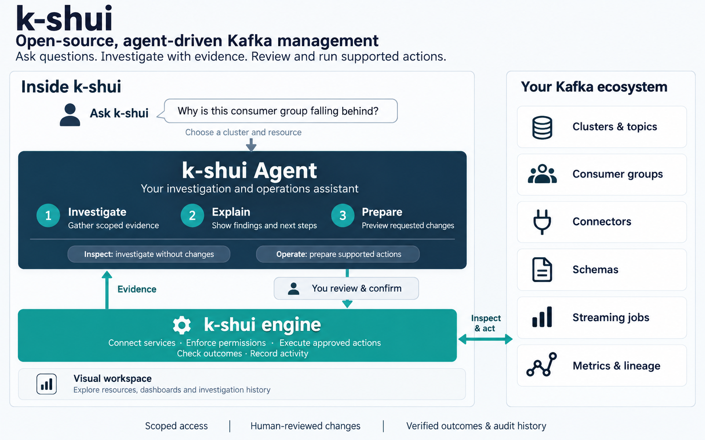

<div align="center">

# k-shui

**Open-source, agent-driven Kafka management**

[Website](https://thadchas.github.io/k-shui/) · [Getting started](https://thadchas.github.io/k-shui/docs/getting-started/) · [Documentation](https://thadchas.github.io/k-shui/docs/)

[Website](https://thadchas.github.io/k-shui/) · [Getting started](https://thadchas.github.io/k-shui/docs/getting-started/) · [Documentation](https://thadchas.github.io/k-shui/docs/)

[](LICENSE)
[](https://github.com/thadchas/k-shui/actions/workflows/ci.yml)
[](https://pypi.org/project/k-shui/)
[](https://www.npmjs.com/package/k-shui)
[](https://github.com/orgs/k-shui/packages/container/package/k-shui)
[](charts/k-shui)

</div>

k-shui helps you investigate and manage Apache Kafka and its streaming ecosystem
through **k-shui Agent**. Ask about a lagging consumer, investigate a failed
connector, or request a supported change. The agent gathers scoped evidence,
explains its findings, and prepares concrete operations for you to review.

The **k-shui engine** connects to your services, enforces permissions, executes
reviewed actions, and records their outcomes. A **visual workspace** gives you
resource pages, message browsing, dashboards, and lineage alongside the agent.
The project is Apache-2.0 licensed and connects to the clusters you already run.

[Get started](docs/getting-started.md) · [Enable k-shui Agent](docs/k-shui-agent.md) · [Documentation](docs/README.md)

## Ask, investigate, review, act

1. **Ask in context.** Open **Ask K-Shui** or a resource's **Investigate** action.
   Choose the cluster and resource you want to understand.
2. **Investigate with evidence.** Review linked observations, retrieval times,
   possible explanations, missing information, and next steps.
3. **Request a supported action.** In **Operate** mode, ask for a specific change
   and review its exact target, parameters, and effect.
4. **Execute and check the outcome.** Complete any required confirmation. The
   engine rechecks permissions and resource state, runs the operation, and
   records verification and audit evidence.

Start with questions such as **“Why is this consumer group falling behind?”**,
**“Explain this connector failure”**, or **“What is connected to this topic?”**
When you want a change, make it explicit: **“Restart task 2 on connector orders”**
or **“Prepare a retention change for topic orders to one day.”**



## What the agent can do today

| Workflow            | Current capability                                                                                                                                                                                                 |
| ------------------- | ------------------------------------------------------------------------------------------------------------------------------------------------------------------------------------------------------------------ |
| Investigate         | Cluster health, topic metadata, consumer lag and membership, connector task states, streaming-job/checkpoint summaries, schema summaries, lineage neighbors, alert evidence, and recent audit headers              |
| Explain             | Findings linked to retrieved evidence, possible explanations, missing information, and next steps                                                                                                                  |
| Prepare and operate | Create topics, update supported topic settings, pause/resume/restart connectors, restart individual connector tasks, delete/purge topics, increase partitions, and reset consumer offsets with the required checks |
| Preserve context    | Scoped investigations, saved history, progress, cancellation, and bounded tool/time/usage limits                                                                                                                   |

**Inspect mode makes no changes.** Operations are a defined subset of the
workspace's capabilities; the agent does not have arbitrary shell, SQL, or
message-payload access. Missing evidence and uncertain outcomes remain visible.
See the [agent guide](docs/k-shui-agent.md) for exact operation boundaries.

**Agent setup is explicit:** the agent is disabled by default. An administrator
must enable it, configure an AI connection and usage rates, and require user
sign-in. Mutations are a separate opt-in. The current agent runs in one
application worker/process; see [deployment requirements](docs/k-shui-agent.md#deployment).

## Visual workspace and ecosystem coverage

Use resource pages to examine the evidence behind an investigation and perform
expert workflows beyond the agent's supported tools. The table below describes
the whole application, not a promise that every operation is agent-accessible.

| Area                     | What you get                                                                                                                                                                            | Docs                                                         |
| ------------------------ | --------------------------------------------------------------------------------------------------------------------------------------------------------------------------------------- | ------------------------------------------------------------ |
| Clusters                 | Multi-cluster switcher, health checks, throughput, KRaft-aware overview                                                                                                                 | [clusters.md](docs/features/clusters.md)                     |
| Brokers                  | Config editor, log dirs, per-broker metrics                                                                                                                                             | [brokers.md](docs/features/brokers.md)                       |
| Topics                   | Create/configure/delete, partition add, targeted purge, clone, config diffing, partition health, preferred-leader election, reassignment plans                                          | [topics.md](docs/features/topics.md)                         |
| Message browser          | Live tail with pause/resume, per-partition seek, produce, JSON/Avro/Protobuf/JSON Schema decode, key/value/header filters (JSONPath/regex), tombstones, CSV/NDJSON export               | [messages.md](docs/features/messages.md)                     |
| Consumers & share groups | Lag in offsets and time, member→partition assignments with skew, dry-run offset reset (earliest/latest/timestamp/shift, partition-scoped), Kafka 4.x share groups                       | [consumers.md](docs/features/consumers.md)                   |
| Schema Registry          | Confluent / Apicurio / Karapace — subjects, versions, diff, compatibility check                                                                                                         | [schemas.md](docs/features/schemas.md)                       |
| Kafka Connect            | Connector CRUD, pause/resume/restart, task status, plugin validation, MirrorMaker2 replication view                                                                                     | [connect.md](docs/features/connect.md)                       |
| ksqlDB                   | SQL editor with streaming results, streams/tables/queries, statement history                                                                                                            | [ksqldb.md](docs/features/ksqldb.md)                         |
| Flink                    | Jobs, checkpoints, execution graph, task managers, jar upload/run, SQL Gateway                                                                                                          | [flink.md](docs/features/flink.md)                           |
| Metrics                  | Prometheus-backed dashboards (Grafana-JSON import), PromQL explorer, sampled fallback                                                                                                   | [metrics.md](docs/features/metrics.md)                       |
| Stream lineage           | OpenLineage/Marquez graph merged with derived Connect/ksqlDB/Flink/consumer edges                                                                                                       | [lineage.md](docs/features/lineage.md)                       |
| Alerts                   | Metric-based triggers, buffered conditions, email/Slack/PagerDuty/Teams/webhook actions, history                                                                                        | [alerts.md](docs/features/alerts.md)                         |
| Security                 | ACLs, quotas, SCRAM users, KRaft quorum view                                                                                                                                            | [security.md](docs/features/security.md)                     |
| Settings & audit         | Cluster dynamic configs, full audit log of mutating actions                                                                                                                             | [settings-and-audit.md](docs/features/settings-and-audit.md) |
| Auth & RBAC              | None / basic (admin, editor, viewer) / OIDC enforced on every API and mirrored in the UI, light & dark theme, keyboard-first ([shortcuts](docs/features/keyboard-and-accessibility.md)) | [auth-rbac.md](docs/features/auth-rbac.md)                   |

## Operator safety model

Every agent operation and visual workflow must respect the acting user's authority:

- **Reviewed agent operations** — exact previews, permission and resource-state
  rechecks, expiring operation identifiers, and recorded outcomes. A diagnostic
  question does not authorize a change.
- **Typed confirmation** for every irreversible action (delete/purge/add
  partitions, ACL and quota removal, Flink cancel, ksqlDB terminate), and a
  mandatory **dry-run preview** before any offset reset.
- **Internal topics** (`__consumer_offsets`, …) have destructive actions
  locked; compacted topics warn before partitions are added.
- **RBAC everywhere** — viewers see the same pages with mutating controls
  disabled, and the API rejects them with `403` regardless of the UI.
- **Secrets stay masked** — connector passwords, tokens, and keystores are
  hidden in every view and can never be saved back as placeholders.
- **Every mutation is audited**, and destructive dialogs explain the
  operational consequence ("offsets survive connector delete", "purge advances
  the start offset") rather than just asking "are you sure?".

## Quick start

Start the application using one of these deployment methods. These commands
open the visual workspace; they do not enable the agent by themselves.

```bash
# uv (no local Python install needed)
uvx k-shui serve

# npx (requires Node.js; launches the application through uv or Docker)
npx k-shui serve

# Docker
docker run -p 8090:8090 -e KSHUI_BOOTSTRAP_SERVERS=host.docker.internal:9092 ghcr.io/thadchas/k-shui

# Helm, on Kubernetes
helm install k-shui oci://ghcr.io/thadchas/charts/k-shui
```

Then open **http://localhost:8090**. With no config file at all, k-shui starts
with a single cluster pointed at `localhost:9092` (or `$KSHUI_BOOTSTRAP_SERVERS`).

### Connect your ecosystem

Generate one with `k-shui init`, or start from this:

```yaml
# k-shui.yaml
server:
  port: 8090

clusters:
  - id: prod
    name: Production
    bootstrapServers: kafka-0:9092,kafka-1:9092,kafka-2:9092
    schemaRegistry:
      url: http://schema-registry:8081
      type: confluent
    connect:
      - name: connect
        url: http://connect:8083
    prometheus:
      url: http://prometheus:9090
```

```bash
uvx k-shui serve --config k-shui.yaml
```

See [`docs/getting-started.md`](docs/getting-started.md) for the full install
walkthrough and [`docs/deployment/configuration-reference.md`](docs/deployment/configuration-reference.md)
for every field.

### Enable your first agent investigation

Follow the [agent setup guide](docs/k-shui-agent.md#deployment) to configure
sign-in, an AI connection, model usage rates, and permitted clusters. Keep
`agent.allowMutations: false` for your first investigation. Restart the
application, sign in, test the configured connection, and open **Ask K-Shui**
in **Inspect** mode. See [getting started](docs/getting-started.md) for the
complete walkthrough.

## Visual workspace screenshots

| Cluster overview                              | Message browser                                   | Stream lineage                             |
| --------------------------------------------- | ------------------------------------------------- | ------------------------------------------ |
|  |       |  |
| Topics                                        | Consumer group                                    | Alerts                                     |
|              |  |           |
| Schemas                                       | Kafka Connect                                     | Flink job                                  |
|            |          |     |

Shown in dark theme; `docs/images/*-light.png` has light-theme captures of the
clusters, overview, topics and message-browser screens.

## Connect to your existing stack

k-shui speaks plain Kafka Admin protocol plus the standard HTTP APIs of each
integration. No collector agent or sidecar is required on your brokers;
**k-shui Agent** runs within the application.

<details>
<summary><b>Strimzi</b> (Kubernetes-native Kafka)</summary>

```yaml
clusters:
  - id: strimzi
    name: Strimzi cluster
    bootstrapServers: my-cluster-kafka-bootstrap.kafka.svc:9092
    properties:
      security.protocol: SSL
      ssl.ca.location: /etc/k-shui/certs/ca.crt
    schemaRegistry:
      url: http://my-cluster-registry.kafka.svc:8081
      type: apicurio
```

</details>

<details>
<summary><b>Confluent Platform / Confluent Cloud</b></summary>

```yaml
clusters:
  - id: confluent-cloud
    name: Confluent Cloud
    bootstrapServers: pkc-xxxxx.us-east-1.aws.confluent.cloud:9092
    properties:
      security.protocol: SASL_SSL
      sasl.mechanism: PLAIN
      sasl.username: ${CCLOUD_API_KEY}
      sasl.password: ${CCLOUD_API_SECRET}
    schemaRegistry:
      url: https://psrc-xxxxx.us-east-2.aws.confluent.cloud
      type: confluent
      auth: {username: ${SR_API_KEY}, password: ${SR_API_SECRET}}
```

</details>

<details>
<summary><b>Amazon MSK</b></summary>

```yaml
clusters:
  - id: msk
    name: MSK
    bootstrapServers: b-1.mycluster.abc123.c2.kafka.us-east-1.amazonaws.com:9098
    properties:
      security.protocol: SASL_SSL
      sasl.mechanism: AWS_MSK_IAM
```

</details>

<details>
<summary><b>Redpanda</b></summary>

```yaml
clusters:
  - id: redpanda
    name: Redpanda
    bootstrapServers: redpanda-0:9092
    schemaRegistry:
      url: http://redpanda-0:8081
      type: confluent # Redpanda's schema registry is Confluent-API compatible
```

</details>

<details>
<summary><b>Apicurio Registry</b></summary>

```yaml
schemaRegistry:
  url: http://apicurio:8080/apis/ccompat/v7
  type: apicurio
```

</details>

<details>
<summary><b>Flink Kubernetes Operator</b></summary>

```yaml
flink:
  - name: session
    url: http://my-flink-session.flink.svc:8081
    sqlGatewayUrl: http://my-flink-sql-gateway.flink.svc:8083
```

</details>

## Product architecture

| Component               | Responsibility                                                                                                 |
| ----------------------- | -------------------------------------------------------------------------------------------------------------- |
| **k-shui Agent**        | Investigates questions, explains evidence, and prepares supported changes                                      |
| **k-shui engine**       | Connects services, checks authority, executes reviewed operations, and records verification and audit evidence |
| **Visual workspace**    | Presents resources, messages, dashboards, lineage, and investigation history                                   |
| **Connected ecosystem** | Your Kafka clusters, connectors, registries, streaming processors, metrics, and lineage services               |

The agent uses bounded tools under the signed-in user's authority. The visual
workspace and agent share the engine's resource integrations; connected
streaming services continue to run the workloads.

See [architecture](docs/architecture.md) for implementation details and
[the platform contract](ARCHITECTURE.md) for configuration and API behavior.

## Deployment

| Method                           | Guide                                                                                    |
| -------------------------------- | ---------------------------------------------------------------------------------------- |
| uv / uvx                         | [docs/deployment/standalone-uv.md](docs/deployment/standalone-uv.md)                     |
| npx                              | [docs/deployment/standalone-npx.md](docs/deployment/standalone-npx.md)                   |
| Docker                           | [docs/deployment/docker.md](docs/deployment/docker.md)                                   |
| Docker Compose (full demo stack) | [docs/deployment/docker-compose.md](docs/deployment/docker-compose.md)                   |
| Kubernetes: Helm                 | [docs/deployment/kubernetes-helm.md](docs/deployment/kubernetes-helm.md)                 |
| Kubernetes: Kustomize            | [docs/deployment/kubernetes-kustomize.md](docs/deployment/kubernetes-kustomize.md)       |
| Security hardening               | [docs/deployment/security-hardening.md](docs/deployment/security-hardening.md)           |
| Full configuration reference     | [docs/deployment/configuration-reference.md](docs/deployment/configuration-reference.md) |

## How it compares

Evaluate k-shui around its investigation-to-action workflow: scoped evidence,
reviewed operations, and the resource workspace that supports both. The
[comparison guide](docs/comparison.md) covers ecosystem capabilities and a
migration map. Agent access is narrower than the application's full feature set;
use the [agent guide](docs/k-shui-agent.md) when evaluating operational coverage.

## Contributing

Contributions are welcome — see [`CONTRIBUTING.md`](CONTRIBUTING.md) for local
setup (`make dev`), the repo layout, and coding standards, and
[`ARCHITECTURE.md`](ARCHITECTURE.md) for the REST/config contract every change
should respect. Please also read [`CODE_OF_CONDUCT.md`](CODE_OF_CONDUCT.md) and
[`SECURITY.md`](SECURITY.md) (vulnerability reporting).

## License

Apache License 2.0 — see [`LICENSE`](LICENSE). Apache Kafka®, Apache Flink®, and
Apache® are trademarks of the Apache Software Foundation. k-shui is not affiliated
with or endorsed by the ASF or Confluent, Inc.
