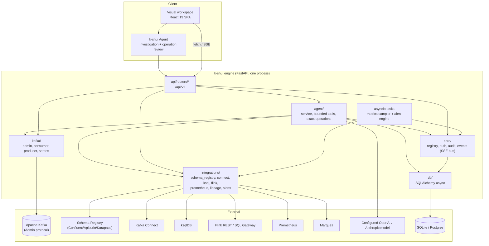

# Architecture

k-shui is an open-source, agent-driven Kafka management application. The
primary workflow is the **k-shui Agent**, backed by the **k-shui engine** and
presented in a visual workspace where an operator can inspect evidence and
review exact operations. The engine is a single FastAPI deployable that serves
the REST/SSE API and built React SPA, then talks outward to Kafka and configured
ecosystem integrations.

The Agent is an optional, disabled-by-default layer over that engine. Direct UI
and REST workflows remain available for expert control. This page covers the
component layout, request flow, data stores, and background jobs. For the Agent
contract, see [`k-shui-agent.md`](k-shui-agent.md); for the full REST/config
contract, see [`../ARCHITECTURE.md`](../ARCHITECTURE.md); for how each feature
uses this, see [`features/`](features/).

## Components

- **Visual workspace** (`frontend/`) — Vite + React 19 + TypeScript + Tailwind
  v4. The Agent panel and dedicated investigation page show scope, evidence,
  limitations, findings, and operation previews alongside the existing expert
  pages. `api/client.ts` wraps `fetch`/SSE; `api/hooks/` are TanStack Query hooks;
  `pages/` has one folder per feature area; `layouts/AppShell` is the
  sidebar/topbar/cluster-switcher/command-palette shell. Built output is
  copied into `backend/k_shui/static/` and served by the backend; there is no
  separate frontend server in production.
- **k-shui Agent** (`backend/k_shui/agent/`, `api/routers/agent.py`) — runs
  scoped investigations using nine bounded metadata tools. It excludes message
  payloads, raw connector traces, arbitrary URLs, SQL, logs, and shell access.
  In Operate mode it can prepare only the supported topic, connector, and
  consumer-offset actions; model tool calls never execute an operation. The
  initiating human must review an exact, expiring preview and supply typed
  confirmation where required.
- **k-shui engine** (`backend/k_shui/`) — Python 3.11+, FastAPI. It enforces
  cluster scope, current user authority, read-only policy, audit persistence,
  operation state checks, and dispatch to Kafka or Kafka Connect.
  - `api/routers/*` — one module per feature area (`topics.py`, `connect.py`,
    `flink.py`, `alerts.py`, ...), auto-registered from `api/__init__.py`'s
    `ROUTER_MODULES` list (a missing/unimportable module is skipped rather
    than crashing startup — useful while a router is still being built).
  - `core/` — `registry.py` (`ClusterRegistry`, holds one context per
    configured cluster: its Admin client, integration clients, and config),
    `auth.py` (users/roles/JWT/OIDC), `audit.py`, `events.py` (the in-process
    SSE fan-out bus feeding `GET /events`), `errors.py` (RFC 9457
    problem+json).
  - `kafka/` — `admin.py` (topics/brokers/configs/ACLs/quotas/KRaft via
    `confluent-kafka`'s Admin client), `consumer.py` (message browsing),
    `producer.py`, `serdes/` (string/json/avro/protobuf/jsonschema, resolving
    against whichever schema registry is configured).
  - `integrations/` — one module per external system, each a thin,
    timeout-guarded HTTP client that raises `IntegrationNotConfigured` (404)
    or `IntegrationUnavailable` (503) rather than propagating a raw
    connection error; `alerts/` holds the trigger evaluation engine and
    notifier implementations (email/Slack/PagerDuty/webhook/Teams).
  - `db/` — SQLAlchemy 2 async models/session, default `sqlite+aiosqlite`,
    optional Postgres via the `postgres` extra.

## Request flow

1. Browser calls `/api/v1/...` (or opens an SSE connection) with a bearer
   token (if auth is enabled).
2. FastAPI dependency (`core/deps.py`) resolves the authenticated principal
   and the target `ClusterRegistry` context for `{cluster}` in the path.
3. The router handler calls into `kafka/admin.py` and/or an `integrations/*`
   client, using that cluster's configured connection details.
4. Mutating calls are recorded via `core/audit.py` before returning, and
   (where relevant) publish an event onto `core/events.py`'s bus for `/events`
   subscribers.
5. Errors from an unreachable/unconfigured integration are translated to
   `problem+json` with `integration-unavailable`/`integration-not-configured`
   — the rest of the app keeps working even if e.g. Flink is down.
6. Non-API paths fall through to the built SPA's `index.html` (client-side
   routing), except recognized reserved prefixes (`api/`, `docs`, `redoc`,
   `openapi.json`, `metrics`, `healthz`, `readyz`).

### Agent investigation and operation flow

1. An authenticated operator opens **Ask K-Shui** or **Investigate**, selects a
   permitted cluster and configured provider/model, and starts in Inspect or
   Operate mode. `auth.type: none` does not grant Agent access.
2. The engine fixes the investigation scope and refreshes the human user's role
   and cluster grants on each tool call. Deployment and connection allowlists
   can narrow the available clusters and tools further.
3. The model may request only the nine metadata tools defined in
   `agent/tools.py`. The engine collects, bounds, redacts, timestamps, and stores
   the resulting evidence; retrieved text is treated as untrusted data.
4. Inspect mode cannot mutate anything. In Operate mode, an explicit supported
   request may create a five-minute preview bound to the user, investigation,
   target, parameters, and observed state.
5. The human reviews the preview in the visual workspace and executes it. The
   engine checks authority and state again, durably claims the operation before
   dispatch, verifies the result, and records operation and audit evidence.

The Agent currently assumes one application worker/process for run admission
and interrupted-run recovery. A shared database does not make Agent runs safe
across independently starting workers. See the existing architecture image at
[`images/k-shui-agent-architecture.png`](images/k-shui-agent-architecture.png).

## Data stores

| Store                 | Holds                                                                                                                                                                          | Default                                                                               |
| --------------------- | ------------------------------------------------------------------------------------------------------------------------------------------------------------------------------ | ------------------------------------------------------------------------------------- |
| Kafka cluster itself  | Topics, configs, ACLs, quotas, offsets — the source of truth for everything Kafka-native                                                                                       | —                                                                                     |
| k-shui's own database | Basic-auth users (if not OIDC), Agent investigations and operation state, alert triggers/actions/history, user-created metrics dashboards, ksqlDB statement history, audit log | `sqlite+aiosqlite:///./k-shui.db`; `postgresql+asyncpg://...` for durable deployments |
| In-memory ring buffer | Sampled metrics when `metricsMode: sampled` (no Prometheus)                                                                                                                    | Process memory — resets on restart                                                    |
| Prometheus (external) | Time-series metrics when configured                                                                                                                                            | —                                                                                     |
| Marquez (external)    | OpenLineage jobs/datasets/runs when configured                                                                                                                                 | —                                                                                     |

SQLite is fine for a single replica. Postgres can provide durable shared state
for non-Agent features in multi-replica deployments, but Agent run admission
and recovery still require a single application process.

## Background jobs

Two asyncio background tasks inside the same process run recurring jobs:

- **Metrics sampler** — every `clusters[].pollIntervalSeconds` (default 15s),
  polls the Admin API per cluster and appends to the in-memory ring buffer
  used by `metricsMode: sampled` fallback charts.
- **Alert engine** — every `alerts.evaluationIntervalSeconds` (default 30s),
  evaluates every enabled trigger against live data (Admin API or
  Prometheus depending on the metric), applies each trigger's `bufferSeconds`
  hysteresis, fires configured actions on state transitions, records history,
  and emits `alert.fired`/`alert.resolved` SSE events. See
  [`features/alerts.md`](features/alerts.md).

Both run in-process — no external scheduler/queue is required, but it also
means alert evaluation and metrics sampling only happen on a _running_
replica; in a multi-replica deployment, ensure exactly the intended number of
replicas are actually up (the background tasks are not distributed/leader-elected
across replicas as of this version — see the [roadmap](roadmap.md)).

## Non-functional design

- Every integration failure degrades gracefully (`503 problem+json`,
  `integration-unavailable`) instead of crashing the app or the page.
- Structured JSON logs (`structlog`), optional OpenTelemetry traces
  (`telemetry.otlpEndpoint`, `otel` extra), Prometheus metrics on `/metrics`.
- CSP header, CSRF-safe token auth, sensitive config values masked in
  responses/logs/audit, login rate-limited.
- The Agent is disabled by default, requires an authenticated human, excludes
  payloads and free-form secret carriers, and rechecks server-side authorization
  at inspection, preview, and execution boundaries.
- Frontend: strict TypeScript, paginated/virtualized lists, loading/empty/
  error states on every page, `⌘K` command palette, responsive down to
  768px.
